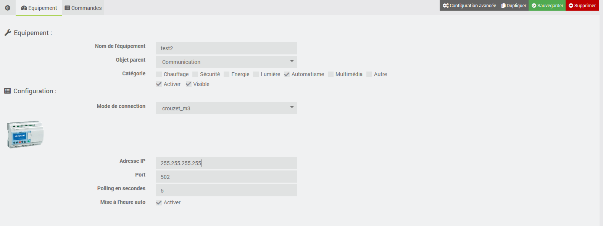

Presentation 
===

Le Plugin MyModBus sert à communiquer en protocole Modbus via plusieurs type de Liaison . 

- Liaison modbus Ethernet 
- Liaison Série Mode RTU ( A venir ) 

Il est compatible avec plusieurs type d'automates (Crouzet, IPX...) 

Configuration du plugin
===

Après le téléchargement du plugin, il vous suffit juste d’activer et d’installer les dépendances Mymodbus (clic sur le bouton Installer/Mettre à jour)

Création d'un équipement
===

Avant de démarrer le demon , il faut commencer par créer un équipement modbus  :

Configuration des équipements 
===

Vous retrouvez ici toute la configuration de votre équipement :

    Nom de l’équipement Mymodbus : nom de votre équipement Mymodbus,

    Objet parent : indique l’objet parent auquel appartient l’équipement,

    Catégorie : les catégories de l’équipement (il peut appartenir à plusieurs catégories),

    Activer : permet de rendre votre équipement actif,

    Visible : rend votre équipement visible sur le dashboard,

En-dessous vous retrouvez la liste des commandes :

    Nom : le nom affiché sur le dashboard,

    Afficher : permet d’afficher la donnée sur le dashboard,

    Tester : permet de tester la commande
	
	

Exemple de configuration pour un automate Crouzet  
===

-  Une fois la configuration renseigner on passe à l'ajout des commandes (infos)

-   Puis les commandes actions : 

	
-   Une fois la configuration terminée cliqué sur sauvegarder le démon démarrera automatiquement etc ;....  : 	

Petite actions très utile :

Jeedom recherche toutes les jours à 00h30 s'il y a un automate à mettre à l'heure , si oui il le fait .

	
Création d'un virtuel
===

Pour se faire vous devez obligatoirement avoir installé le plugin "virtuel" 

Il faut maintenant créer les commandes du virtuel pour cela on s'appuie sur les commandes crées précédemment : 

" #[Cuisine][Cuisine][MODBUS_ETAT_ECL_CUISINE]# &2 "

" #[Cuisine][Cuisine][MODBUS_BP_ECL_CUISINE]# "

